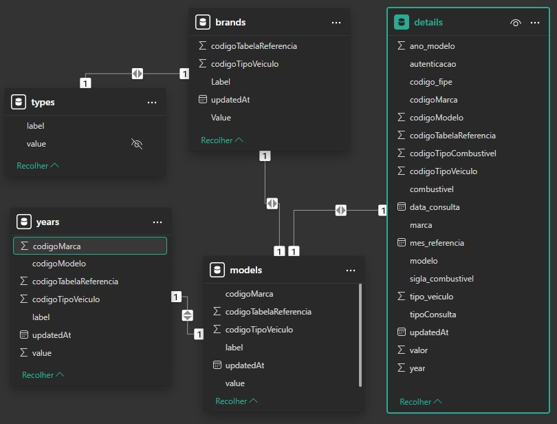

# FIPE-PYTHON: Web Crawler para Consulta de Veículos na [Tabela FIPE](https://veiculos.fipe.org.br/)
## Autor: [Felipe Alves de Morais](https://github.com/FelipeTr00)

O projeto **FIPE-PYTHON**, possui back-end implementado em Python com FastAPI. O servidor busca dados do site da [**FIPE - fipe.org.br**](https://veiculos.fipe.org.br/), utiliza cache (opcional) armazenado em um **banco de dados SQLite** e expõe endpoints para consulta de **tipos**, **marcas**, **modelos**, **anos** e **detalhes** de **carros**, **motos** e **caminhões**.

---

## ÍNDICE

1. [OBJETIVOS](#OBJETIVOS)  
2. [APP](#APP)  
3. [SERVER](#SERVER)  
4. [LICENÇA](#LICENÇA)  
5. [NOTAS E CONSIDERAÇÕES](#NOTAS-E-CONSIDERAÇÕES)

---

## OBJETIVOS

1. **Coletar Dados Atualizados**  
   - Implementar um web crawler eficiente para extrair os preços de veículos diretamente da fonte oficial da Tabela FIPE.
   - Automatizar o processo de atualização dos dados para garantir que sempre estejam atualizados.

2. **Armazenamento Estruturado**  
   - Armazenar os dados coletados em um formato estruturado, como JSON, CSV ou banco de dados SQL/NoSQL.
   - Garantir integridade e consistência dos dados coletados.

3. **Facilidade de Consulta e Análise**  
   - Criar uma API ou interface para facilitar o acesso e consulta aos dados coletados.
   - Permitir filtragem e análise dos preços de veículos por categoria, modelo, ano e outros critérios relevantes.

4. **Automatização e Escalabilidade**  
   - Desenvolver um sistema que possa rodar periodicamente e ser escalado conforme a necessidade.
   - Implementar boas práticas de web scraping para evitar bloqueios e manter a eficiência do crawler.

5. **Documentação e Manutenção**  
   - Produzir uma documentação clara e objetiva sobre o funcionamento do web crawler e do sistema em geral.
   - Definir estratégias para manutenção e evolução do projeto, garantindo sua continuidade e confiabilidade.

O projeto **FIPE-Python** busca oferecer uma solução automatizada, confiável e eficiente para a coleta e análise de preços da Tabela FIPE, facilitando a obtenção de informações atualizadas sobre veículos no mercado brasileiro.

---
## APP 

### Em desenvolvimento...

## SERVER 

### Estrutura do Servidor/API
    server/
    ├── database/                # Arquivo SQLite (db.sqlite)
    ├── migrations/              # Scripts de migração (schema.sql, etc.)
    ├── crawler/                 # Scripts de mineração dos dados (models.py, etc.)
    ├── src/
    │   ├── __init__.py          # Inicializador do pacote
    │   ├── main.py              # Ponto de entrada da aplicação FastAPI
    │   ├── routes.py            # Definição das rotas/endpoint
    │   ├── fipe.py              # Lógica de integração com a API FIPE e cache
    │   └── db.py                # Módulo de conexão e operações com o banco SQLite
    ├── .env                     # Variáveis de ambiente
    ├── requirements.txt         # Dependências do Python
    └── SERVER-README.md         # Este arquivo

### Run
    py -m server.src.main

### Port
    http://localhost:8000/v1

### DER - Banco de Dados

#### Obs.: Foram mantidos nomes dos campos conforme FIPE.
---

## Tabelas

O banco de dados contém as seguintes tabelas:

### **Tabela `brands`** (Marcas dos Veículos)
| Coluna                 | Tipo    | Descrição                         |
|------------------------|--------|-----------------------------------|
| Label                 | TEXT   | Nome da marca                    |
| Value                 | TEXT   | Código da marca                  |
| codigoTabelaReferencia| INTEGER| Código da tabela FIPE            |
| codigoTipoVeiculo     | INTEGER| Tipo do veículo (1 = Carro, etc) |
| updatedAt             | TEXT   | Data da última atualização       |

---

### **Tabela `models`** (Modelos de Veículos)
| Coluna                 | Tipo    | Descrição                         |
|------------------------|--------|-----------------------------------|
| value                 | INTEGER| Código do modelo                  |
| label                 | TEXT   | Nome do modelo                    |
| codigoTabelaReferencia| INTEGER| Código da tabela FIPE            |
| codigoTipoVeiculo     | INTEGER| Tipo do veículo                  |
| codigoMarca           | INTEGER| Código da marca correspondente   |
| updatedAt             | TEXT   | Data da última atualização       |

---

### **Tabela `years`** (Anos dos Modelos)
| Coluna                 | Tipo    | Descrição                         |
|------------------------|--------|-----------------------------------|
| value                 | TEXT   | Ano do modelo                     |
| label                 | TEXT   | Descrição do ano                  |
| codigoTabelaReferencia| INTEGER| Código da tabela FIPE            |
| codigoTipoVeiculo     | INTEGER| Tipo do veículo                  |
| codigoMarca           | INTEGER| Código da marca                  |
| codigoModelo          | INTEGER| Código do modelo                  |
| updatedAt             | TEXT   | Data da última atualização       |

---

### **Tabela `details`** (Detalhes dos Veículos)
| Coluna                 | Tipo    | Descrição                         |
|------------------------|--------|-----------------------------------|
| year                  | INTEGER| Ano do veículo                    |
| valor                 | TEXT   | Valor FIPE do veículo             |
| marca                 | TEXT   | Nome da marca                     |
| modelo                | TEXT   | Nome do modelo                    |
| ano_modelo            | INTEGER| Ano do modelo                     |
| combustivel           | TEXT   | Tipo de combustível               |
| codigo_fipe           | TEXT   | Código FIPE do veículo            |
| mes_referencia        | TEXT   | Mês de referência FIPE            |
| autenticacao          | TEXT   | Código de autenticação            |
| tipo_veiculo          | INTEGER| Tipo do veículo                   |
| sigla_combustivel     | TEXT   | Sigla do combustível (G, F, etc.) |
| data_consulta         | TEXT   | Data da consulta                  |
| updatedAt             | TEXT   | Data da última atualização        |
| codigoTabelaReferencia| INTEGER| Código da tabela FIPE             |
| codigoTipoVeiculo     | INTEGER| Tipo do veículo                   |
| codigoMarca           | INTEGER| Código da marca                   |
| codigoModelo          | INTEGER| Código do modelo                  |
| codigoTipoCombustivel | INTEGER| Código do tipo de combustível     |
| tipoConsulta          | TEXT   | Tipo de consulta FIPE             |

---

### Endpoints API

| **Método** | **Endpoint** | **Descrição** |
|------------|----------------------------------|------------------------------------------------------------|
| `GET` | `/v1/{types}` | Retorna os tipos de veículos disponíveis. |
| `GET` | `/v1/brands/{type}` | Retorna as marcas disponíveis para um tipo de veículo. |
| `GET` | `/v1/models/{type}/{brand}` | Retorna os modelos de uma marca específica. |
| `GET` | `/v1/years/{type}/{brand}/{model}` | Retorna os anos disponíveis para um modelo específico. |
| `GET` | `/v1/details/{type}/{brand}/{model}/{year}` | Retorna os detalhes do veículo com base nos 4 parâmetros informados. |
| `GET` | `/v1` | Extra, retorna a versão da API. |
|

* **Mais detalhes: [Documentação do Servidor](server/README.md)**

## LICENÇA

### Distribuído sob a [Licença MIT](LICENCE.txt).

## NOTAS E CONSIDERAÇÕES

Este projeto foi baseado e inspirado no trabalho de [Olavo Mello](https://github.com/olavomello/fipe-api). Agradeço pelo projeto original que serviu como modelo para esta implementação.

